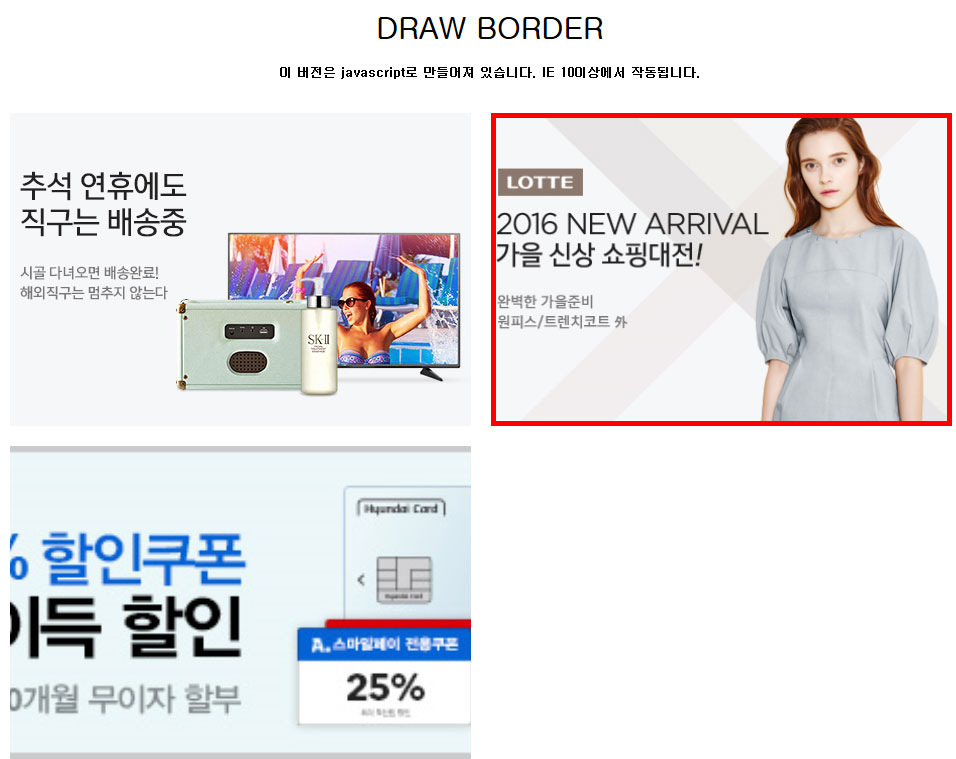

# [목차이동](https://github.com/Guide-Line/Auction-promotion-guide#TOC)

## <a name='border_effect'>border_effect</a>

  
    
```javascript
	<link rel="stylesheet" href="css/drawboard.css"> 
	<script type="text/javascript" src="js/drawborder.js"></script>


	 .lineEffect ul li:first-child a {background: url("http://image.gmarket.co.kr/service_image/2016/09/09/20160909093027698851_0_0.jpg") no-repeat center center;background-size: cover;}
    .lineEffect ul li:first-child + li a {background: url("http://image.gmarket.co.kr/service_image/2016/09/09/20160909093007805498_0_0.jpg") no-repeat center center;background-size: cover;}
	.lineEffect ul li:first-child + li + li a {background: url("http://image.auction.co.kr/DA/2016/10/10/20161010143413295072_4000000654_1.JPG") no-repeat center center;background-size: cover;}
    
    .lineEffect2 ul li:first-child a {background: url("http://image.gmarket.co.kr/service_image/2016/09/09/20160909093027698851_0_0.jpg") no-repeat center center;background-size: cover;}
    .lineEffect2 ul li:first-child + li a {background: url("http://image.gmarket.co.kr/service_image/2016/09/09/20160909093007805498_0_0.jpg") no-repeat center center;background-size: cover;}


    <!-- 효과1 동시에 나타남 -->
    <div class="lineEffect">
    	<ul>
            <li>
                <a href="#" class="block">
                    <div class="block-texts">
                        <h1>BorderLine</h1>
                        <h2>이버전은 javascript로 만들어져 있습니다.</h2>
                        <h3>IE 10이상에서 작동됩니다.</h3>
                    </div>
                </a>

            </li>
            <li>
                <a href="#" class="block">
                    <div class="block-texts">
                        <h1>BorderLine</h1>
                        <h2>이버전은 javascript로 만들어져 있습니다.</h2>
                        <h3>IE 10이상에서 작동됩니다.</h3>
                    </div>
                </a>
            </li>
			<li>
                <a href="#" class="block">
                    <div class="block-texts">
                        <h1>BorderLine</h1>
                        <h2>이버전은 javascript로 만들어져 있습니다.</h2>
                        <h3>IE 10이상에서 작동됩니다.</h3>
                    </div>
                </a>
            </li>
    	</ul>
    </div>
    
    
    <!-- 효과2  네모를 그려지듯이 나타남 -->
    <div class="lineEffect2">
    	<ul>
            <li>
                <a href="#" class="block">
                    <div class="block-texts">
                        <h1>BorderLine</h1>
                        <h2>이버전은 javascript로 만들어져 있습니다.</h2>
                        <h3>IE 10이상에서 작동됩니다.</h3>
                    </div>
                </a>
            </li>
            <li>
                <a href="#" class="block">
                    <div class="block-texts">
                        <h1>BorderLine</h1>
                        <h2>이버전은 javascript로 만들어져 있습니다.</h2>
                        <h3>IE 10이상에서 작동됩니다.</h3>
                    </div>
                </a>
            </li>
    	</ul>
    </div>

```
 
